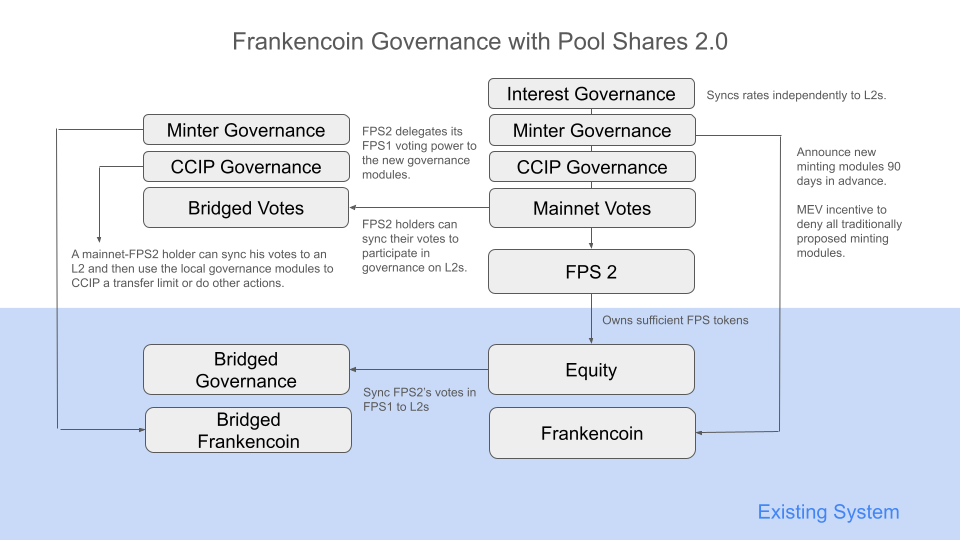

# Frankencoin Shares (FCS)

FCS wraps the existing Frankencoin Pool Share (FPS1) to form a "shareholder agreement" among participating holders. No one is forced to join, but doing so grants access to improved governance mechanics and a revised redemption mechanism designed to prevent a "bank-run" in case of a large anticipated loss. FCS follows the ERC-4626 tokenized vault standard, making it compatible with wallets and DeFi integrations that support it.

## Contracts

| Contract | Description | Notable Dependencies |
|---|---|---|
| `FCS` | Frankencoin Shares. Wraps FPS1 with revised governance and redemption mechanics. | `AccumulatingVotesToken`, `FCSMintRedeem` |
| `AccumulatingVotesToken` | Extends ERC20 with a time-based vote accumulation logic, mostly copied from Equity | `ERC20` |
| `FCSMintRedeem` | Logic to wrap FPS1 into FCS, mint FCS from ZCHF, and redeem FCS into ZCHF with temporary price declines on large sales to discourage 'bank runs'. | `ERC20`, `IERC4626`, `Equity` (FPS1) |
| `GovernanceFactory` | Only used during first time deployment. | `MainnetVotes`, `BridgedVotes`, `CCIPGovernance`, `MinterGovernance`, `InterestGovernance` |
| `MainnetVotes` | Delegation logic and qualification check for FCS on mainnet. Also contains CCIP sync functions to L2s. | `Governance`, `CCIPSender`, `FCS` |
| `BridgedVotes` | Delegation logic and qualification check for FCS on L2s. Also contains CCIP reception functions. | `Governance`, `CCIPReceiver` |
| `GovernanceModule` | Base module to enable FCS holders to perform legacy (FPS1) governance actions. | `MainnetVotes` / `BridgedVotes`  |
| `CCIPGovernance` | Lets qualified FCS holders exercise CCIP governance. On all chains. | `GovernanceModule`, `CCIPAdmin` |
| `MinterGovernance` | Lets qualified FCS holders suggest and veto minters; enforces a new 90-day application period. On all chains. | `GovernanceModule`, `Frankencoin`, `IPosition` |
| `InterestGovernance` | Lets qualified FCS holders adjust FPS1-based interest rates. Mainnet only and synced separately. | `GovernanceModule`, `Savings` |

## Governance

FCS lowers the veto threshold from 2% of all votes (FPS1) to 1%, making it easier for a minority of holders to block harmful minter proposals. Additionally, the minimum application period is increased to 60 days, giving ZCHF holders more time to react to proposals they disagree with and enforcing more stability.

### Vote Accumulation

Like previously with FPS1, votes grow linearly with both the number of FCS held and the time they have been held. Specifically, an address holding *n* FCS for *t* seconds accumulates *n* &times; *t* votes. This rewards long-term commitment: a holder who has been in the system for a year has far more governance weight than someone who just arrived with the same number of shares.

Like previously with FPS1, votes can be delegated in a non-rivalrous way. Unlike in other protocols, Frankencoin delegations are not subtractive: delegating your votes to someone does not reduce your own voting power, it simply allows the delegate to use your votes when casting a veto. Delegation chains are supported (A delegates to B, B delegates to C -- C can use all three). Each address is only counted once, such that delegation cycles do not lead to infinite votes.

To prevent lost or inactive addresses from accumulating votes indefinitely, anyone can cap a holder's effective holding duration at one year. This ensures that no forgotten address gains unbounded governance power.

Like FPS1, FCS includes an `attack` function that allows a holder to sacrifice their own votes in order to destroy an equal number of votes belonging to other addresses. This is a defensive mechanism: if a hostile party accumulates votes, other holders can altruistically coordinate to neutralize the threat at a cost to themselves.

### Veto Rights

Any holder (or group of holders via delegation) that controls at least 1% of total votes can veto a pending minter proposal. Many current (and future) Frankencoin modules rely on this functionality and contain functions that can only be executed by those with veto power.

FCS further introduces a function that allows anyone to veto minter proposals that have been proposed directly on the Frankencoin token contract. Anyone casting such a veto even gets a bounty, incentivizing bots to take immediate action whenever someone tries to use the legacy minter proposal mechanism.

### Cross-Chain Governance

FCS governance extends the existing veto-based cross-chain model (see [ccg.md](./ccg.md)) to reach every chain on which Frankencoin is deployed. Before being able to exercise voting power on another chain, votes must be synchronized from mainnet.

The editable original of this diagram can be found [here](https://docs.google.com/presentation/d/16biuIMfSLLX5Yli9H3nk3dFmIiiX62zwsQaWhXInR1M/edit?usp=sharing). The MainnetVotes and the BridgedVotes contracts keep the vote count including delegations and have functions for cross-chain synchronization. The CCIPGovernance, MinterGovernance and InterestGovernance contract allow FCS holders to exercise governance functions designed for FPS1 holders

Before votes can be used on other chains, two pre-conditions must be fulfilled:

1. The FPS1 votes of the FCS contract must be synchronized to the target chain using the GovernanceSender.pushVotes function.
2. The FCS votes of the user must be synchronized to the target chain using the MainnetVotes.pushFCSVotes function.

Step 1 typically only need to be done once per target chain. Step 2 typically needs to be done once per user that wants to use their votes. From time to time, both might need to be refreshed.

## Issuance and Redemption

### Issuance

FCS can be obtained in two ways:

1. **Wrapping FPS1:** Existing FPS1 holders can wrap their tokens 1:1 into FCS via the `wrap` function. Accumulated FPS1 votes carry over, so long-term holders do not lose their governance weight by joining.

2. **Minting with ZCHF:** Anyone can deposit ZCHF to receive new FCS. The ZCHF is invested into the underlying Equity contract (FPS1) at the current FPS1 price, and the resulting FPS1 shares are held by the FCS contract. The investment price (the "ask") equals the FPS1 price.

New investments also reduce the weighted recent redemption counter, helping the bid price recover faster after a period of selling.

### Redemption

FCS can be redeemed for ZCHF at any time -- there is no 90-day holding requirement like in FPS1. However, the redemption price (the "bid") is subject to a discount that depends on recent redemption activity.

**How the discount works:**

The contract tracks the volume of recent redemptions. This counter decays linearly to zero over a 7-day recovery period. When someone redeems, the effective proceeds are:

> effective proceeds = raw FPS1 proceeds &times; discount factor

The discount factor is calculated as:

> discount = ((supply - shares/2) / (supply + recentRedemptions))^4

where *supply* is the current FCS supply, *shares* is the number being redeemed, and *recentRedemptions* is the time-weighted recent redemption volume.

The 4th-power curve means that small redemptions in calm markets face only a minor haircut (around 2% for 1% of supply), but large or rapid redemptions face steep discounts. The portion of proceeds not paid to the redeemer (the "spread") flows back into the Equity contract, benefiting all remaining holders.

In practice, this means:

- **Isolated small redemption:** If you redeem 100 out of 10,000 FCS with no recent activity, you receive about 98% of the underlying FPS1 value.
- **Sustained selling at 100/day:** The discount deepens over time as the redemption memory accumulates. By day 10, the discount factor drops to about 81%, and by day 20 to about 74%.
- **Recovery:** After selling stops, the discount decays back to zero over 7 days.

### Stress Scenario

Consider 10,000 FCS in circulation backed by 4,000,000 ZCHF in equity (FPS price: 1,200 ZCHF). An imminent loss of 1,000,000 ZCHF is about to hit the protocol. Without the FCS mechanism, rational holders would race to redeem before the loss materializes.

**Without FCS (plain FPS1):** The cubic pricing curve in FPS1 means early redeemers extract disproportionate value. In equilibrium, nearly all holders redeem (9,900 out of 10,000), draining essentially all equity. Because after the first million was withdrawn from the contract, the loss is still imminent and it still makes sense to sell even more. Once the 1,000,000 loss hits, the system is insolvent. The only escape is a sufficent number of FPS holders that believe in the long term value of the project and that agree to hold on to their FPS despite the imminent loss in order to save the system.

**With FCS (4th-power discount):** The discount ramps up with each redemption, making it progressively less attractive to exit. In equilibrium, only about 900 holders redeem (9%), extracting 838,000 ZCHF at an average price of 931 ZCHF per share. The remaining 9,100 holders absorb the 1,000,000 loss with 2,162,000 ZCHF of equity left, resulting in a post-loss price of 713 ZCHF. The discount mechanism converts a destructive bank run into a self-limiting process: early sellers still can get out at a high price, but each redemption makes the next one less attractive until holding becomes the rational choice.

## Relation to FPS1

FCS holds FPS1 tokens on behalf of its holders. Each FCS is backed 1:1 by an FPS1 token in the contract. The FPS1 voting power of the FCS contract is delegated to the governance contract, which exercises it on behalf of FCS holders.

FCS becomes **binding** when the contract controls more than 2/3 of all FPS1 votes, i.e. when a sufficient number of FPS holders joined the new contract for a sufficient amount of time. Once binding:

- Holders cannot unwrap their FCS back to FPS1 any longer (they are committed to the agreement).
- Anyone can use the `shoot` function to destroy the votes of FPS1 holders who remain outside the agreement, preventing them from taking part in the governance or redeeming their FPS1.
- Holders can still redeem FCS for ZCHF at any time (subject to the discount), but they cannot extract the underlying FPS1 tokens.

FCS can become unbinding again if enough FCS are redeemed or enough new FPS1 are minted outside the contract, pushing the vote share below 2/3.